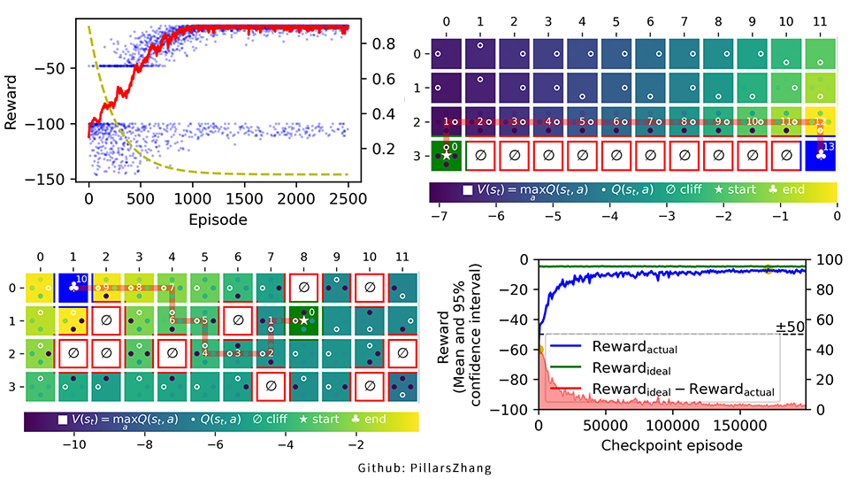

# Q Learning Cliff Walking (Q table and DQN)

This project adds random traps to the classic cliff walking environment, so DQN is also a solution. It's not very difficult to realize **Q table** and **DQN**. I have carried out complete result analysis and tedious visualization in this project. Due to time constraints, the code is not very concise and reasonable, but I am very satisfied with the output results.



## Result

- **Standard Cliff Walking (Solution based on Q table)**
  - It is impossible not to find the best path after *2,500* episodes of training.
- **Advanced Cliff Walking (Solution based on DQN)**
  - *95.2%* success rate in 1000 tests, after *145,000* episodes of training.
- **Advanced Cliff Walking with an indefinite number of cliffs (Solution based on DQN)**
  - *97.0%* success rate in 1000 tests, after *96,000* episodes of training.

## Environment

**Python 3.10** is perfered, since I used some new PEP features. View `requirements.txt` for other dependencies.

## Usage

It is recommended to use **VSCode for debugging**. I have preset `.vscode/launch.json`.

I also prepared a bash script for the **pipeline**, which can execute the processing items as needed.

```
# Run all processes
./run.sh --device cuda:0 --train --bench --demo --test
```

You can run each process separately.

```
# Run train and bench (It takes a lot of time)
./run.sh --device cuda:0 --train --bench
# Run demo and test (And log to file)
mkdir -p saved
./run.sh --device cuda:0 --demo --test | tee saved/run.log
```

However, the training and demonstration of the following 3 environments are independent, and you can run them at the same time.

### Standard Cliff Walking (Solution based on Q table)

The effect should be the same as that of `CliffWalking-v0` of gym (Maybe there are differences in details).

```
# train
python standard_qtable.py
# demo
python demo_standard_qtable.py --run
```

### Advanced Cliff Walking (Solution based on DQN)

It uses the same 4x12 map as `CliffWalking-v0`, but will randomly generate 10 cliffs (perhaps better named traps) and start-end points that can ensure connectivity.

```
# train
python advanced_dqn.py --device cuda:0
# bench
python bench_advanced_dqn.py --device cuda:0
# demo
python demo_advanced_dqn.py --device cuda:0 --run
```

### Advanced Cliff Walking with an indefinite number of cliffs (Solution based on DQN)

Same as above, but the number of cliffs is random between 0-10.

```
# train
python advanced_dqn.py --device cuda:0 --rand
# bench
python bench_advanced_dqn.py --device cuda:0 --rand
# demo
python demo_advanced_dqn.py --device cuda:0 --run --rand
```

## Reference

- [Reinforcement Learning (DQN) Tutorial](https://pytorch.org/tutorials/intermediate/reinforcement_q_learning.html)
- [Discount factor gamma](https://towardsdatascience.com/practical-reinforcement-learning-02-getting-started-with-q-learning-582f63e4acd9)
- [Exponential moving average (EMA)](https://en.wikipedia.org/wiki/Moving_average)
- Thomas H. Cormen, Charles E. Leiserson, Ronald L. Rivest, and Clifford Stein], Introduction to Algorithms, Second Edition. MIT Press and McGraw-Hill, 2001. ISBN 0-262-03293-7. Section 22.2: Breadth-first search, pp. 531–539.
- 王琦，杨毅远，江季，Easy RL：强化学习教程，人民邮电出版社，https://github.com/datawhalechina/easy-rl, 2022.
